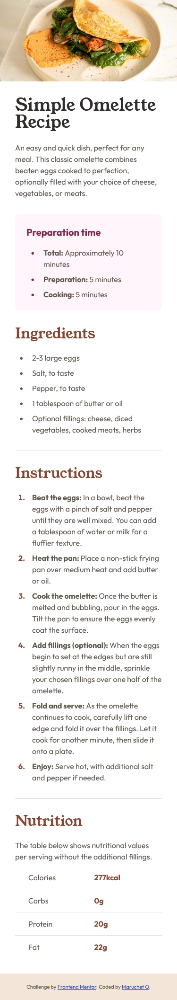

# Frontend Mentor - Recipe page solution

This is a solution to the [Recipe page challenge on Frontend Mentor](https://www.frontendmentor.io/challenges/recipe-page-KiTsR8QQKm). Frontend Mentor challenges help you improve your coding skills by building realistic projects.

## Table of contents

- [Overview](#overview)
  - [The challenge](#the-challenge)
  - [Screenshot](#screenshot)
  - [Links](#links)
- [My process](#my-process)
  - [Built with](#built-with)
  - [What I learned](#what-i-learned)
- [Author](#author)
- [Acknowledgments](#acknowledgments)

## Overview

### Screenshot




### Links

- Live Site URL: [Link](https://marucheto.github.io/Recipe-page/)

## My process

### Built with

- Semantic HTML5 markup
- CSS custom properties
- Flexbox
- CSS Grid
- Mobile-first workflow

### What I learned

```html
<table>
  <tr class="border">
    <td class="indent">Calories</td>
    <td class="number">277kcal</td>
  </tr>
  <tr class="border">
    <td class="indent">Carbs</td>
    <td class="number">0g</td>
  </tr>
  <tr class="border">
    <td class="indent">Protein</td>
    <td class="number">20g</td>
  </tr>
  <tr>
    <td class="indent">Fat</td>
    <td class="number">22g</td>
  </tr>
</table>
```

```css
body {
  display: grid;
  place-content: center;
}
tr {
  display: grid;
  grid-template-columns: repeat(2, 1fr);
}
```

If you want more help with writing markdown, we'd recommend checking out [The Markdown Guide](https://www.markdownguide.org/) to learn more.

## Author

- Frontend Mentor - [@MaruchetO](https://www.frontendmentor.io/profile/MaruchetO)

## Acknowledgments

I really appriciate this tool [Font-size Clamp Generator](https://clamp.font-size.app/). I use it for responsive font-size, and adapt it for image and div size.

<!-- https://jsfiddle.net/2xzbqc8r/ -->
